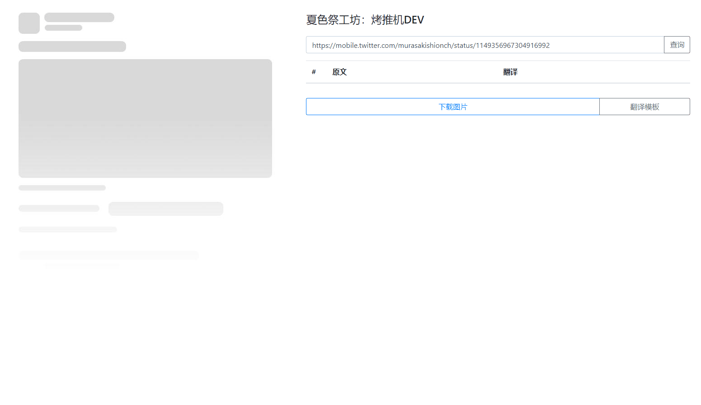

# 夏色祭工坊 TweetToaster 烤推机

<p align="center">
  
</p>

## 简介
这个烤肉机，其实是个推特嵌字机。  
出现的初衷因该是，嵌字这件事儿，大家都爱不动了。  
来回p图一样的东西，有些伤不起啊。  

于是，为了解决重复性工作，工坊招了程序员，也终于搞出来了这个项目。  

此项目主要感谢以下贡献者  
[FzXiao](https://github.com/fzxiao233) [b站](https://space.bilibili.com/2387011)  
[飞雪](https://github.com/wudifeixue) [b站](http://space.bilibili.com/739848)  
[鱼鱼](https://github.com/yuyuyzl) [b站](https://space.bilibili.com/1534590)  

## 功能

- 接受 `7216_2nd`、`@7216_2nd`、`x.com/7216_2nd` 等主页输入
- 接受带或不带 `https://` 的 `x.com/.../status/...`、`twitter.com/.../status/...` 单推链接
- 主页模式列出多条近期公开推文，默认预览前三条，可任意勾选
- 单推模式同时列出上下文、目标推文和其他用户回复，可逐条选择、逐条翻译
- 保留旧版翻译组 Logo、自定义 Logo 与 `{T}` HTML 翻译模板
- 预览和下载共用 Chromium 渲染面；导出为 640 CSS px / 1280 实际像素的 2x PNG
- 兼容旧 Bot 的 `/api/auto` + `/api/get_task=<id>` 异步协议
- 默认使用免费公开的 FxTwitter/FxEmbed API，可切换到自建实例

## 直接部署预构建镜像

镜像由 GitHub Actions 发布到 GHCR，不需要在服务器现场构建：

```bash
docker run -d \
  --name tweettoaster \
  --restart unless-stopped \
  --shm-size=512m \
  -p 127.0.0.1:8082:8082 \
  -v tweet-cache:/app/Matsuri_translation/frontend/cache \
  ghcr.io/cn-matsuri/tweettoaster:latest
```

仓库内的 Compose 文件同样只拉镜像：

```bash
docker compose pull
docker compose up -d
curl http://127.0.0.1:8082/api/health
```

每个同仓库 PR 还会发布 `pr-<编号>` 测试标签；合并到 `master` 后发布 `latest`，版本 tag 会发布同名镜像标签。

镜像清单同时包含 `linux/amd64` 与 `linux/arm64`。它可以直接运行在 Linux Docker，以及 macOS/Windows 的 Docker Desktop；这是 Linux 容器，不是 Windows 原生容器。

在 Nginx、Caddy 或 Cloudflare Tunnel 中把域名反代到 `127.0.0.1:8082` 即可。默认只监听本机，避免绕过反向代理直接暴露端口。

### 环境变量

| 变量 | 默认值 | 用途 |
| --- | --- | --- |
| `PORT` | `8082` | HTTP 端口 |
| `HOST` | `0.0.0.0` | 监听地址 |
| `CHROMIUM_PATH` | 自动发现 | Bot/下载截图使用的 Chromium；镜像内已配置 |
| `TWEET_PROVIDER_URL` | `https://api.fxtwitter.com/2` | 免费推文数据源根地址；也可指向自建 FxEmbed |
| `TWEET_PROVIDER_TIMEOUT_MS` | `15000` | 数据源超时毫秒数 |
| `TWEET_TIMELINE_COUNT` | `12` | 主页最多显示的近期推文数，范围 1–20 |
| `TWEET_REPLY_COUNT` | `20` | 单推最多显示的回复数，范围 0–30 |
| `TEMPLATE_ALLOWED_HOSTS` | `x.wudifeixue.com,raw.githubusercontent.com` | Bot 可下载模板的 HTTPS 域名白名单 |

## Bot API 兼容

创建任务：

```http
POST /api/auto
Content-Type: application/json

{
  "tweet": "https://x.com/user/status/123",
  "translate": "翻译文字",
  "template": "https://tweet.wudifeixue.com/template/matsuri.txt",
  "noLikes": false,
  "logo": "official"
}
```

返回 `200 {"task_id":"..."}`。轮询 `GET /api/get_task=<task_id>`；成功时 `state` 为 `SUCCESS`，`result` 是文件名，图片位于 `/cache/<result>.png`。

旧 Bot 的多条翻译格式继续可用：

```text
##1
第一条翻译
##2
第二条翻译
```

`tweet` 现在也可以传主页或用户名。`template` 可留空、直接传模板 HTML、传 `/template/name.txt` 本地路径，或传白名单内的 HTTPS 模板地址。远程模板限制为 64 KB，并拒绝内网地址。

把 [toastTemplates](https://github.com/cn-matsuri/toastTemplates) 放到 `Matsuri_translation/frontend/template/`（该目录已被 Git 忽略），原来的 `/template/*.txt` Bot 参数和 `?template=/template/*.txt` 网页链接可以继续使用。旧模板的多样式注释格式也仍兼容。

## 本地开发与测试

需要 Node.js 22+ 和 Chrome/Chromium：

```bash
corepack enable
pnpm install
pnpm test
pnpm start
```

打开 <http://localhost:8082>。真实免费数据源回归测试单独运行：

```bash
pnpm test:live
```

PR 会执行单元测试、浏览器下载回归、依赖审计，以及 amd64/arm64 镜像构建。下载回归会检查翻译组 Logo 的显示宽高比与源图一致，防止再次发生预览正常、下载拉伸。

## 数据源与费用

默认数据来自免费的 [FxEmbed/FxTwitter](https://github.com/FxEmbed/FxEmbed) 公开 API，不需要 API Key，不接入任何付费 X API。公共实例可能调整限流或可用性；长期部署可自建 FxEmbed，再修改 `TWEET_PROVIDER_URL`，TweetToaster 本身无需改代码。

---

## 旧版项目记忆（保留）



### 发布文章 / Blog

[庆贺吧，这是集数码暴龙与嵌字 man 力量于一身的烤推机](https://www.bilibili.com/read/cv3081959)

旧版使用方法：打开烤肉机后，输入需要查询的推特永久链接；查询、输入翻译内容，满意后下载图片。模板可以完全自定义，自己写 HTML 即可。

烤肉机模板源码地址：[cn-matsuri/toastTemplates](https://github.com/cn-matsuri/toastTemplates)

### 使用感想 / Testimonial


